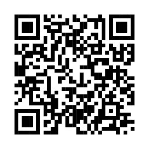

# Lumix cameras settings

Settings for lumix s5ii and s5iix cameras

## Format SD Card

> [!NOTE]
> Before formatting, please note
>
> - Since data cannot be recovered after formatting, make sure to back up necessary data in advance.
> - Format the card before recording a picture with this unit.
> - Do not turn the camera off during formatting.

1. Press [ MENU ].
2. Select [ SETUP  ].
3. Select [ Card/File  ].
4. Select [ Card Format ].
5. Select [ Slot1 or Slot 2 ].
6. Select [ YES ].

## LUTs (color profiles)

All of the movie mode uses v-log color profile, to get accurate colours, you will need to download one or more of these LUTs (Look-up Table):

- [VLog_to_V709_forV35_EN](https://av.jpn.support.panasonic.com/support/global/cs/dsc/download/lut/index.html)
- (applies to both s5ii and s5iix cameras) ***you will need this***

> [!NOTE]
> For using Atomos Ninja, check the [Advanced LUTs](#advanced-luts) section.

## Camera dial settings

Click on the different modes to see more details

| dial | aspect ratio | resolution | framerate | sensor coverage | iso | white balance |
| --- | --- | --- | --- | --- | --- | --- |
| [PASM](#p-a-s-m-picture) | 3:2 | 24mp | --- | full | auto | AWB |
| [:movie_camera: M](#movie_camera-m) | 16:9 | 4K | 60p | cropped 1:1 | auto | AWBc |
| [S&Q](#sq-slow--quick-motion) | 16:9 | 4K | 30p | cropped | auto | AWBc |
| [C1](#c1-full-frame-169) | 16:9 | 5.9K | 24p | full | 640iso | AWB |
| [C2](#c2-full-frame-open-gate) | 3:2 | 6K | 24p | full | 640iso | 5500k |
| [C3](#c3-anamorphic) | 2.39:1 | 6K | 24p | full | 640iso | 5500k |

### P-A-S-M (picture)

- 1/125th second shutter speed
- f3.5 (wide open) aperture
- auto iso
- AWB (auto white balance)

### :movie_camera: M

- 4K 60p 420 10-L / MOV / PIXEL-PIXEL
- 180deg shutter angle
- f3.5 (wide open) aperture
- auto iso
- AWBc (auto white balance - cooler)

### S&Q (Slow & Quick Motion)

- 4K 30p 420 10-L / MOV / APS-C
- 180deg shutter angle
- f3.5 (wide open) aperture
- auto iso
- AWBc (auto white balance - cooler)

[How to use Slow and Quick Motion | LUMIX Academy | S5](https://www.youtube.com/watch?v=mZHvR_kL-PY&ab_channel=LUMIX)

### C1 (full frame 16:9)

- 5.9K 24p 420 10-L / MOV / FULL
- 180deg shutter angle
- f3.5 (wide open) aperture
- 640 iso
- AWB (auto white balance)

### C2 (full frame open gate)

- 6K 24p 420 10-L / MOV / FULL
- 3:2 FULL FRAME
- 180deg shutter angle
- f3.5 (wide open) aperture
- 640 iso
- 5500k (daylight white balance)

### C3 (anamorphic)

- 6K 24p 420 10-L / MOV / FULL
- 3:2 FULL FRAME
- Anamorphic 1.5x Desqueeze
- Anamorphic 1.5x Stabilization
- 180deg shutter angle
- f3.5 (wide open) aperture
- 640 iso
- 5500k (daylight white balance)

## Camera custom settings

In the `camera-settings` folder, you can find the folder to drag and drop on your SD card to restore camera settings to custom defaults. Each camera has its own settings and can only be loaded for each specific camera model.

## Advanced LUTs

If you want to unlock the maximum quality, you can use an external recorder to record [Apple ProRes RAW](https://support.apple.com/en-ca/102124), in which case, you will need this:

- [V-Log/V-Gamut conversion of RAW output data](https://av.jpn.support.panasonic.com/support/global/cs/dsc/download/lut/s1h_raw_lut/index.html)
- (only possible with s5iix) ***not likely for students, but Bruce and I probably need it***
